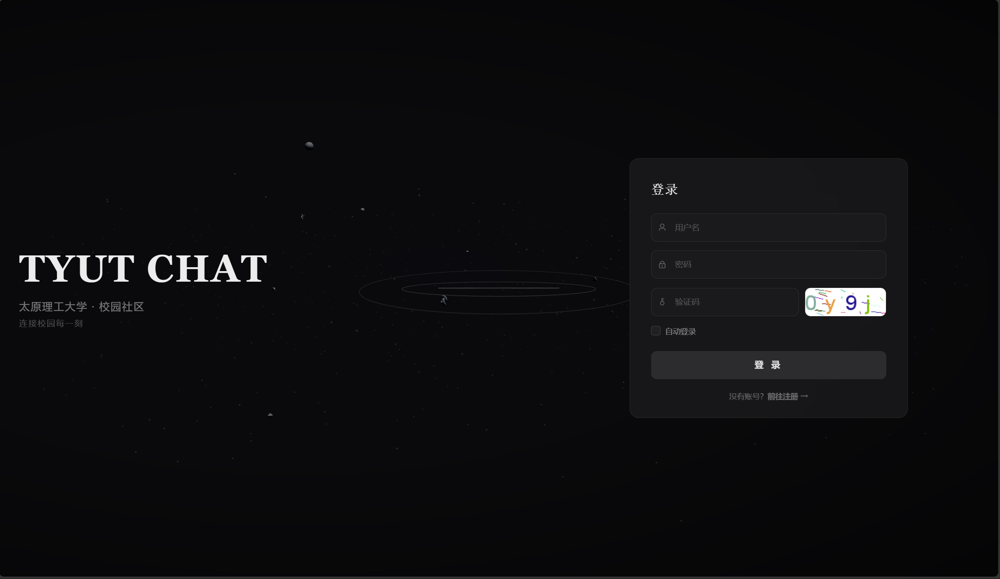
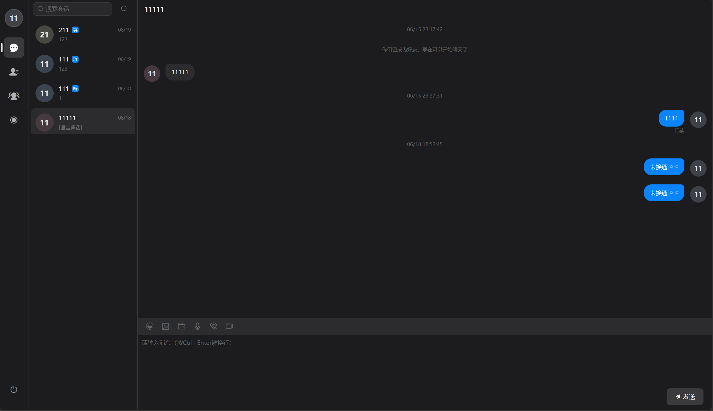
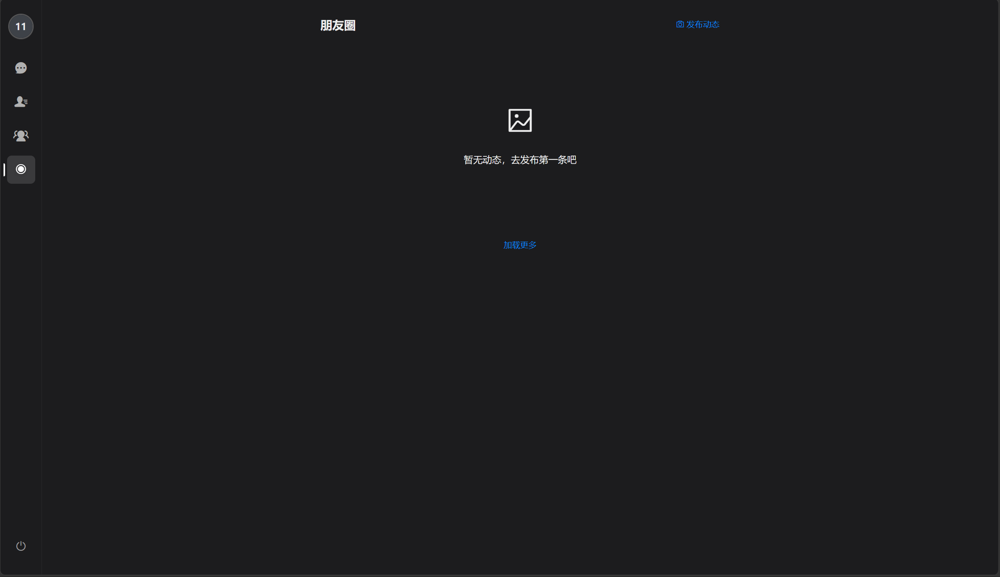

# tyut-chat

[](LICENSE)
[](https://adoptium.net/)
[](https://spring.io/projects/spring-boot)
[](https://v2.vuejs.org/)

> 校园即时通讯系统 —— 仿微信网页端，私聊 / 群聊 / 文件 / 音视频通话 / 朋友圈，一套全有。

tyut-chat 是一个完整的网页即时通讯系统，覆盖 IM 核心场景：文字消息、图片语音文件传输、群 @ 提及、已读未读、朋友圈动态，以及基于原生 WebRTC 的一对一音视频通话。后端支持多节点集群部署，消息在节点间通过 Redis 队列路由。

## 截图

| 登录页 | 聊天界面 | 朋友圈 |
|---|---|---|
|  |  |  |

## 为什么值得关注

大多数课程设计的 IM 项目做到"能发消息"就结束了。这个项目的不同在于：

- **音视频通话不用第三方 SDK**。市面上同类项目几乎全部调腾讯云 TRTC 或声网 Agora 的付费 API，本项目从信令协商、ICE 穿透到媒体流传输全部走原生 WebRTC，零外部依赖。
- **消息推送支持集群化**。不是单机 WebSocket 广播。chat-platform（业务层）和 chat-server（推送层）通过 Redis List 解耦，新增 chat-server 节点只需改配置，消息路由自动适配。
- **功能完整度超出课设要求**。除了基础 IM，还实现了朋友圈动态、敏感词过滤、文件存储（MinIO），是一个可以直接部署到校内使用的完整产品。

## 架构

```
  Browser (Vue 2)
       |
       | HTTP (REST API)          WebSocket
       v                              ^
  chat-platform (Spring Boot)         |
       |                              |
       | 消息写入 Redis List           |
       v                              |
     Redis                      chat-server (Netty)
       |                              |
       | 消息从 Redis List 消费        |
       +------------------------------+
                     |
               MySQL / MinIO
```

- **chat-platform**：HTTP 业务层。处理登录注册、好友群组、朋友圈、文件上传、已读回执等所有业务逻辑。发消息时，它把消息放进 Redis 队列而不是直接推送。
- **chat-server**：WebSocket 推送层。基于 Netty 实现，每个节点只消费自己对应的 Redis 队列，把消息推到目标用户的浏览器。
- **chat-client**：推送 SDK，供 chat-platform 调用，封装了与 chat-server 的通信协议。
- **chat-common**：公共模块，DTO / 枚举 / 工具类。

消息流转：用户 A 发消息 → chat-platform 查 Redis 找到用户 B 连接的 chat-server 节点 ID → 写入对应节点队列 → chat-server 消费队列 → 推送到用户 B 浏览器。

## 功能

| 模块 | 功能 |
|---|---|
| 私聊 / 群聊 | 文字、表情、图片、语音、文件；离线消息；已读未读 |
| 群管理 | @ 提及、群公告、成员管理 |
| 音视频通话 | 一对一 WebRTC 通话，信令通过 WebSocket 协商，无需第三方 SDK |
| 朋友圈 | 发布图文动态，好友可见，类似微信朋友圈 |
| 文件存储 | 图片 / 语音 / 文件上传至 MinIO（S3 兼容对象存储） |
| 内容安全 | 内置敏感词过滤，消息发送时自动检测替换 |
| 多端同步 | 多窗口同时在线，消息实时同步到所有窗口 |
| 用户系统 | 注册登录、JWT 鉴权、好友添加 / 删除 / 备注 |

## 技术选型

| 层 | 选型 | 为什么 |
|---|---|---|
| 后端框架 | Spring Boot 3.3 | 企业级生态，MyBatis-Plus 简化持久层 |
| 即时推送 | Netty WebSocket | NIO 异步非阻塞，单节点支撑万级并发连接 |
| 消息队列 | Redis List | 轻量，不需要单独部署 RabbitMQ/Kafka，实现跨节点消息路由 |
| 对象存储 | MinIO | S3 兼容，图片 / 语音 / 文件不落本地磁盘 |
| 数据库 | MySQL 8.0 | 经典可靠，存储用户 / 好友 / 群组 / 消息记录 |
| 前端 | Vue 2 + Element UI | 快速构建管理后台风格的聊天界面 |
| 音视频 | WebRTC | 浏览器原生能力，零 SDK 依赖 |

## 项目结构

```
tyut-chat/
├── chat-platform/    # 业务平台（HTTP REST API）
├── chat-server/      # 消息推送（Netty WebSocket）
├── chat-client/      # 推送 SDK（供 platform 调用 server）
├── chat-common/      # 公共模块
├── chat-web/         # Vue 2 前端
├── db/               # 数据库脚本（含版本化迁移）
└── docs/             # 课设文档 / 设计文档 / 开发计划
```

## 本地启动

### 1. 环境准备

| 组件 | 版本 | 说明 |
|---|---|---|
| JDK | 17 | |
| Maven | 3.9+ | |
| Node.js | 18.19+ | |
| MySQL | 8.0 | root / root，创建库 `im_platform_open` |
| Redis | 6.2+ | 默认端口 6379 |
| MinIO | latest | 默认 `minioadmin / minioadmin`，API 端口 9000 |

### 2. 初始化数据库

```bash
# 创建数据库后导入表结构
mysql -u root -p im_platform_open < db/im-platform.sql
```

### 3. 启动后端

```bash
# 编译
mvn clean package -DskipTests

# 启动业务平台（HTTP 服务）
java -jar chat-platform/target/chat-platform.jar

# 另开终端，启动消息推送服务（WebSocket）
java -jar chat-server/target/chat-server.jar
```

### 4. 启动前端

```bash
cd chat-web
npm install
npm run serve
```

浏览器访问 `http://localhost:8080`。

## 部署

项目设计支持集群部署：

1. 按需启动多个 `chat-server` 实例，每个实例配置不同的 `server.id`
2. 所有实例共享同一个 Redis 和 MySQL
3. chat-platform 根据 Redis 中记录的用户连接信息，自动将消息路由到正确的 chat-server 节点

详细部署文档见 `docs/`。

## 文档

- [课设要求](docs/课设要求-校园即时通信与文件传输系统.md)
- [团队分工](docs/团队分工.md)
- [开发计划](docs/plan/)
- [个人开发文档](docs/个人开发文档/)

## 许可证

MIT License · 详见 [LICENSE](LICENSE)

## 致谢

太原理工大学软件工程课程设计项目。感谢所有贡献者的付出。
