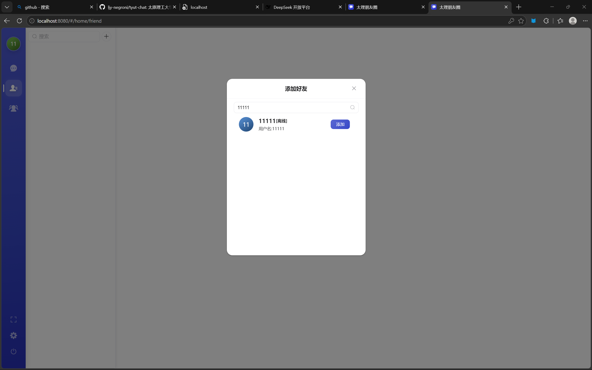
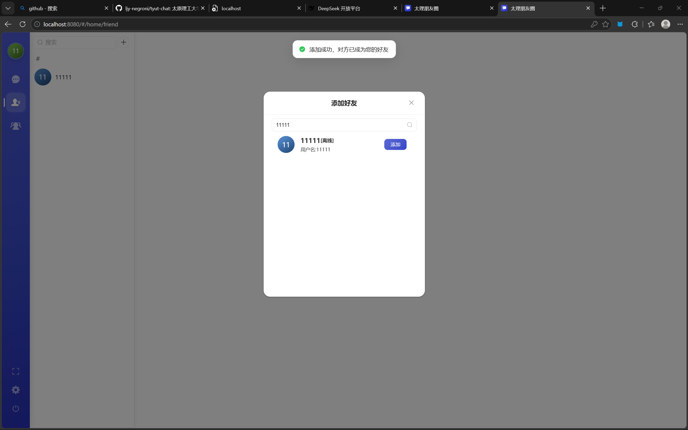
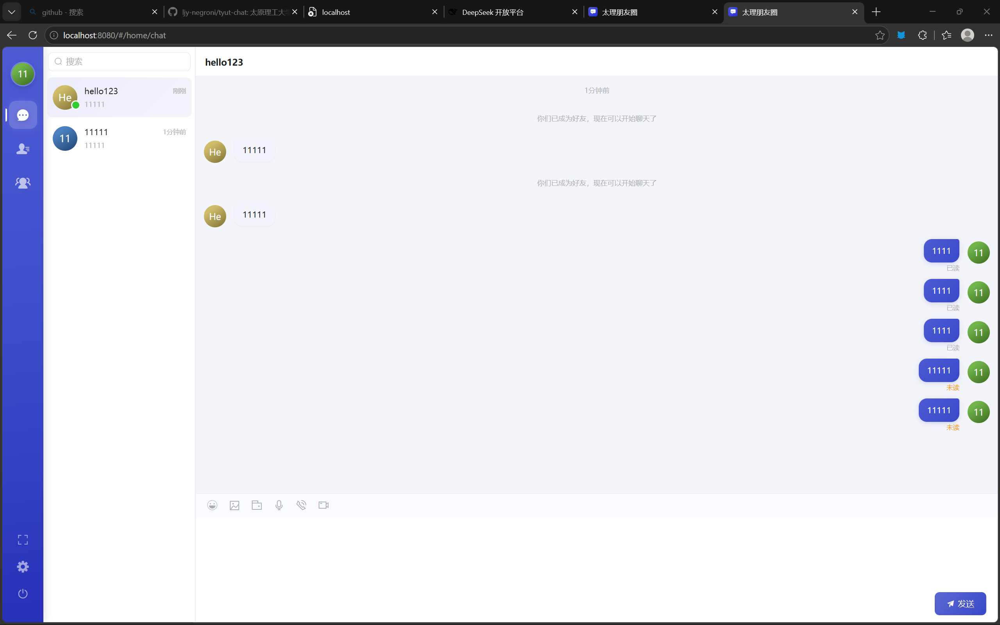
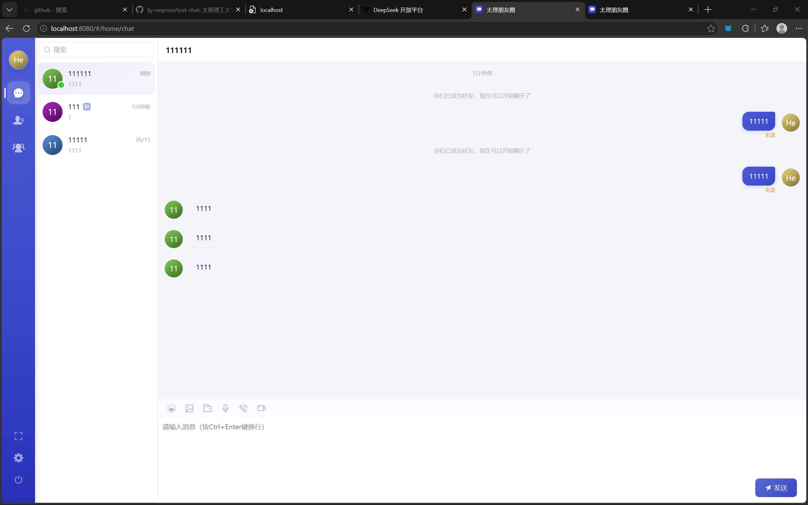

# 前端需求记录

> 记录人：wbs
> 日期：2026-06-18
> 版本：73a3f73

---

## 需求一：添加好友改为申请-同意模式

**问题描述**：

当前添加好友的逻辑存在严重缺陷——用户 A 添加用户 B 后直接成为好友，用户 B 无需确认。更不合理的是，用户 B 也需要反过来搜索并添加用户 A，双方才能正常聊天。这不符合 QQ/微信等主流 IM 的好友添加流程。

**当前表现**：

1. 用户 A 搜索用户 B → 点击"加为好友"→ 提示"添加成功"
2. 用户 A 的好友列表中出现了用户 B
3. 但用户 B 的好友列表中没有用户 A
4. 用户 B 也需要搜索并添加用户 A，双方才能互相看到

**复现步骤**：

1. 用 `zhangsan` 登录，搜索 `lisi`，点击加为好友 → 提示成功
2. 用户 A 能看到 B，但 B 看不到 A

**截图**：

> 
> 
> *(用户 A 的好友列表中有对方，但用户 B 没有)*
>
> 
>
> *(用户 B 也需要手动搜索添加才能互相看到)*

**期望行为**（对标 QQ/微信）：

1. 用户 A 点击"加为好友"→ 发送好友申请
2. 用户 B 收到好友申请通知（红色角标或弹窗提示）
3. 用户 B 进入好友申请列表，可选择"同意"或"拒绝"
4. 同意后双方好友列表同时出现对方，可以正常聊天
5. 拒绝后 A 收到提示"对方已拒绝"

**涉及范围**：

- 前端：好友申请通知 UI、待处理申请列表、申请状态展示
- 后端：好友申请表（friend_request）、好友关系改为三态（无关系/待确认/已添加）

---

## 需求二：消息接收不实时，需刷新页面

**问题描述**：

当前聊天消息无法实时接收。用户 A 给用户 B 发送消息后，用户 B 的聊天界面不会自动显示新消息，必须手动刷新页面才能看到。私聊和群聊均存在此问题。作为即时通讯应用，消息的实时性是核心功能。

**当前表现**：

1. 用户 A 向用户 B 发消息 → 用户 A 看到消息已发送
2. 用户 B 界面无任何变化，没有新消息提示
3. 用户 B 刷新页面后，消息才出现

**复现步骤**：

1. 用 `zhangsan` 登录 Chrome，用 `lisi` 登录 Edge
2. `zhangsan` 向 `lisi` 发一条消息，发送成功
3. 切换到 Edge，`lisi` 的聊天界面没有收到新消息
4. `lisi` 刷新页面（F5），消息才显示出来

**截图**：

> 
>
> *(用户 A 发送消息后，用户 B 的聊天界面无新消息，必须刷新才能看到)*
>
> 
>
> *(群聊也存在同样问题，不刷新就收不到)*

**期望行为**：

1. 用户 A 发送消息后，用户 B 立刻在聊天界面看到新消息
2. 新消息自动滚动到聊天区域底部
3. 未读消息在会话列表中有红点/数字角标提示
4. 群聊消息同样实时推送，无需刷新

**可能原因分析**：

- chat-server（WebSocket 推送服务，端口 8878）存在 Redis MQ 消费异常（`Cannot read Redis info: Malformed \uxxxx encoding`），导致消息无法通过 WebSocket 推送到前端
- 前端 `wssocket.js` 连接可能未正常建立或消息处理逻辑有遗漏

**涉及范围**：

- 前端：WebSocket 连接状态检查、消息接收处理逻辑
- 后端：chat-server 的 Redis MQ 消费异常修复（`RedisMQPullTask` 读取 Redis info 时的编码兼容问题）

---

## 后续计划

- [ ] 需求一：调研后端好友申请表结构，设计好友申请 UI
- [ ] 需求二：排查 chat-server Redis MQ 消费异常，修复 WebSocket 消息推送
