# 太理朋友圈 —— 系统设计文档

> 版本：v1.0
> 日期：2026-06-20
> 作者：软件2457 第六小组

---

## 目录

**第一部分：总体设计**
1. [设计目标与原则](#一设计目标与原则)
2. [系统架构设计](#二系统架构设计)
3. [技术选型与约束](#三技术选型与约束)
4. [模块划分与包图](#四模块划分与包图)
5. [部署架构](#五部署架构)

**第二部分：详细设计**
6. [各模块处理过程设计](#六各模块处理过程设计)
7. [核心流程设计](#七核心流程设计)
8. [数据库设计](#八数据库设计)
9. [接口设计](#九接口设计)
10. [核心类图设计](#十核心类图设计)
11. [安全设计](#十一安全设计)

**第三部分：AI 辅助**
12. [AI 辅助系统设计使用说明](#十二ai-辅助系统设计使用说明)

**附录**
13. [附录](#十三附录)

---

# 第一部分：总体设计

## 一、设计目标与原则

### 1.1 设计目标

基于需求分析文档 v1.0 中的 21 项功能需求（F-01 ~ F-21）与 19 项非功能需求，系统设计须达成以下目标：

| 目标 | 需求来源 | 设计指标 |
|---|---|---|
| **模块化** | 规约第二条（四模块+一前端）、NFR-可维护性 | 模块职责单一，单向依赖，接口清晰 |
| **实时性** | F-06/F-07/F-08（消息收发与推送） | 同节点推送 <200ms，跨节点 <500ms |
| **可扩展** | F-20（集群化部署）、NFR-可扩展性 | chat-server 支持水平扩展，通过 Redis 解耦 |
| **安全性** | NFR-安全性（JWT、密码加密、敏感信息保护） | 令牌认证、加盐哈希、环境变量注入 |
| **用户体验** | PLAN.md（品牌化）、NFR-用户体验 | 消除模板化观感，统一品牌视觉 |
| **易维护** | 规约第九/十一条（文档、脚本版本化） | 文档进 `docs/`，DDL 版本化 |

### 1.2 设计原则

1. **单向依赖**：`common → client → server/platform`，禁止反向依赖（规约第二条）。
2. **接口隔离**：模块间通过 REST API / SDK / Redis 队列通信，不共享数据库直连。
3. **无状态服务**：chat-server 与 chat-platform 均为无状态节点，状态外移至 Redis。
4. **约定优于配置**：包名 `com.tyut.im*`、技术栈版本统一由根 POM `<dependencyManagement>` 管控（规约第十二条）。
5. **AI 辅助、人工决策**：AI 提供设计方案初稿与备选方案，最终由人审查确认（规约第六条）。

---

## 二、系统架构设计

### 2.1 系统架构图

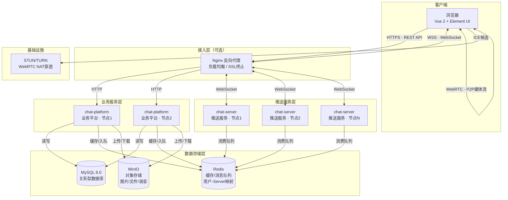

> **图 1：系统架构图**
>
> - **接入层**：Nginx 做反向代理与 SSL 终止，将 HTTP 请求路由到 chat-platform，WebSocket 连接路由到 chat-server。
> - **业务服务层**：chat-platform 处理所有业务逻辑（用户、好友、群组、消息持久化），通过 chat-client SDK 将推送消息写入 Redis 队列。
> - **推送服务层**：chat-server 集群各自消费 Redis 中属于自己的消息队列，通过 WebSocket 推送给目标用户。
> - **数据存储层**：MySQL 存储业务数据；Redis 承担缓存、用户-Server 映射、消息队列三重角色；MinIO 存储文件/图片/语音。
> - **基础设施**：STUN/TURN 服务器支撑 WebRTC NAT 穿透与媒体中继。

### 2.2 分层架构图

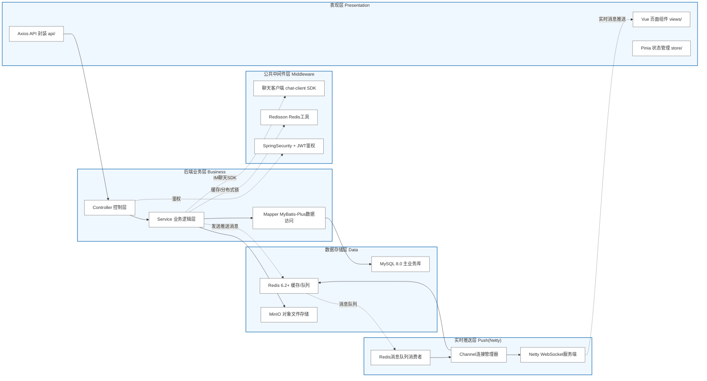

> **图 2：分层架构图**
>
> 严格遵循"上层依赖下层，下层不感知上层"的分层原则。chat-platform 承载表现层（通过 REST 接口）、业务层与中间件层；chat-server 承载推送层；数据层被业务层和推送层共享访问。

### 2.3 模块职责一览

| 模块 | 定位 | 核心职责 | 依赖 |
|---|---|---|---|
| `chat-common` | 公共基础包 | 实体类（Entity/DTO）、枚举、工具类、异常定义、通用常量 | 无 |
| `chat-client` | 推送 SDK | 封装与 chat-server 的通信协议，提供 `PushClient` 供 platform 调用 | chat-common |
| `chat-server` | 推送服务 | Netty WebSocket 服务器，管理用户连接、消费 Redis 队列、推送消息、转发 WebRTC 信令 | chat-common |
| `chat-platform` | 业务平台 | REST API 控制器、业务逻辑、数据持久化、JWT 认证、文件上传、通过 chat-client 下发推送 | chat-common, chat-client |
| `chat-web` | Web 前端 | Vue 2 单页应用，用户界面、WebSocket 连接管理、WebRTC 通话 UI、消息展示 | 独立工程 |

---

## 三、技术选型与约束

### 3.1 技术栈总览

| 层 | 技术 | 版本 | 用途 | 选型理由 |
|---|---|---|---|---|
| **后端框架** | Spring Boot | 3.3.x | 业务服务框架 | 企业级生态，自动配置，与 Netty 集成良好 |
| **网络框架** | Netty | 4.1.x | WebSocket 推送服务 | 高性能 NIO，支撑万级长连接 |
| **ORM** | MyBatis-Plus | 3.5.x | 数据库操作 | 简化 CRUD，与 Druid 配合 |
| **连接池** | Druid | 1.2.x | 数据库连接池 | SQL 监控、慢查询分析 |
| **缓存** | Redis + Redisson | Redis 6.2+ / Redisson 3.23+ | 缓存、消息队列、分布式锁 | 成熟方案，Lua 脚本原子操作 |
| **对象存储** | MinIO | latest | 图片/文件/语音存储 | 开源、S3 兼容、轻量部署 |
| **认证** | JWT (jjwt) | 0.12.x | 用户身份令牌 | 无状态、适合分布式 |
| **API 文档** | Knife4j | 4.x | Swagger 增强文档 | 自动生成、在线调试 |
| **前端框架** | Vue 2 + Element UI | 2.x | Web 界面 | 规约锁定，组件丰富 |
| **状态管理** | Pinia | 2.x | 前端状态管理 | Vue 2 兼容，类型友好 |
| **实时通信** | WebRTC | 浏览器原生 | 音视频通话 | 免费、P2P、浏览器内置 |
| **构建工具** | Maven | 3.9.x | 后端构建 | 多模块管理，版本集中管控 |

### 3.2 技术约束

- **锁定**：上述技术栈不得未经书面同意更换（规约第三条）。
- **版本统一**：新增依赖版本在根 POM `<dependencyManagement>` 集中声明（规约第十二条）。
- **JDK**：17，使用其 LTS 特性（Record、Sealed Class、Pattern Matching 等按需使用）。
- **编码**：UTF-8，换行符 LF（规约第十三条）。

---

## 四、模块划分与包图

### 4.1 后端包图

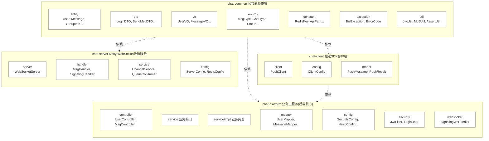

> **图 3：后端包图**
>
> 所有模块统一在 `com.tyut.im` 包名下。依赖方向严格单向：`chat-common` 是全模块的公共基础，`chat-client` 作为 SDK 封装被 `chat-platform` 依赖，`chat-server` 和 `chat-platform` 均不互相依赖。

### 4.2 包与类说明

| 包路径 | 所属模块 | 说明 |
|---|---|---|
| `com.tyut.im.common.entity` | chat-common | 数据库实体映射（User, Message, GroupInfo, GroupMember, Friend, CallRecord） |
| `com.tyut.im.common.dto` | chat-common | 请求/响应数据传输对象 |
| `com.tyut.im.common.vo` | chat-common | 视图对象，给前端返回的扁平化数据 |
| `com.tyut.im.common.enums` | chat-common | 枚举类（MessageType, ChatType, FriendStatus, GroupRole 等） |
| `com.tyut.im.common.constant` | chat-common | 常量定义（Redis Key 前缀、API 路径、文件大小限制等） |
| `com.tyut.im.common.exception` | chat-common | 自定义异常（BizException）及错误码枚举（ErrorCode） |
| `com.tyut.im.common.util` | chat-common | 工具类（JwtUtil, Md5Util, AssertUtil） |
| `com.tyut.im.client` | chat-client | PushClient（推送 SDK 核心类）及其配置 |
| `com.tyut.im.server` | chat-server | Netty WebSocket 服务启动、Channel 管理 |
| `com.tyut.im.server.handler` | chat-server | Netty ChannelHandler（消息处理、信令转发） |
| `com.tyut.im.server.service` | chat-server | Redis 队列消费、用户连接管理 |
| `com.tyut.im.platform.controller` | chat-platform | REST API 控制器 |
| `com.tyut.im.platform.service` | chat-platform | 业务逻辑接口与实现 |
| `com.tyut.im.platform.mapper` | chat-platform | MyBatis-Plus Mapper 接口 |
| `com.tyut.im.platform.security` | chat-platform | JWT 过滤器、Spring Security 配置 |
| `com.tyut.im.platform.websocket` | chat-platform | WebRTC 信令 WebSocket 处理器 |

---

## 五、部署架构

### 5.1 部署拓扑

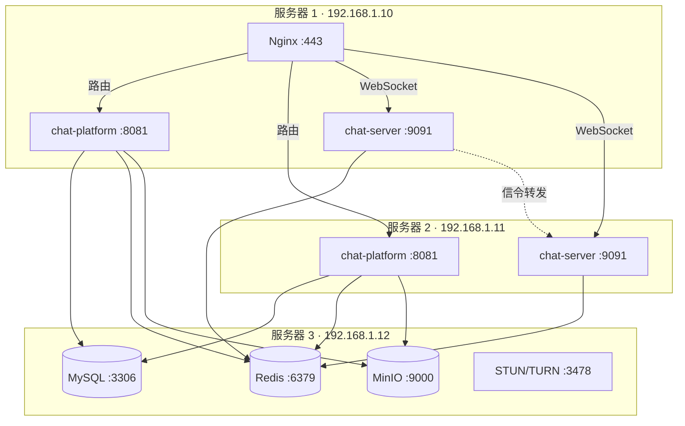

> **图 4：部署拓扑图**
>
> **最小部署**：单机运行所有服务（开发/测试环境）。
> **生产部署**：chat-platform 和 chat-server 各至少 2 节点分布在 2 台以上服务器，MySQL/Redis/MinIO 独立部署。Nginx 做统一入口与负载均衡。

### 5.2 集群化消息路由机制

```
                发送方                          接收方
                  │                               ▲
                  │ 1.发送消息                     │ 6.WebSocket推送
                  ▼                               │
          ┌─────────────────┐            ┌─────────────────┐
          │  chat-platform  │            │  chat-server-2  │
          │  (节点A)        │            │  (接收方连接节点) │
          └───────┬─────────┘            └────────┬────────┘
                  │                               │
                  │ 2.查询接收方Server              │ 5.消费队列
                  ▼                               │
          ┌─────────────────┐            ┌────────┴────────┐
          │     Redis       │            │     Redis       │
          │ user:server:    │            │ im:unread:      │
          │   {userId} → s2 │            │   server-2      │
          └───────┬─────────┘            │   [msg1,msg2..] │
                  │                      └────────┬────────┘
                  │ 3.写入目标队列                  │
                  └────────────────────────────────┘
                      im:unread:server-2 ← msg
```

> **图 5：跨节点消息路由机制**
>
> 1. 发送方调用 chat-platform 发送消息。
> 2. chat-platform 查询 Redis `user:server:{userId}` 获取接收方当前连接的 chat-server ID。
> 3. chat-platform 通过 chat-client SDK 将消息写入 Redis List `im:unread:{serverId}`。
> 4. 目标 chat-server 节点消费自己的队列，通过 WebSocket 推送给接收方。
> 5. 若接收方离线，消息保留在 MySQL 的离线消息表中，上线后拉取。
>
> **设计要点**：chat-server 各节点只消费 `im:unread:{本节点ID}` 的队列，天然支持多节点并行消费，避免消息竞争。

---

# 第二部分：详细设计

## 六、各模块处理过程设计

### 6.1 chat-common —— 公共基础模块

**模块定位**：整个后端的公共语言基础，定义所有模块共享的数据结构、枚举、工具、异常。

**处理职责**：

| 组件 | 职责 | 设计要点 |
|---|---|---|
| **Entity 实体类** | 数据库表结构的 Java 映射 | 使用 MyBatis-Plus 注解（`@TableName`, `@TableId`），与数据库表严格一一对应 |
| **DTO 传输对象** | 前后端之间、模块间的数据传输 | 与 Entity 分离，避免数据库结构直接暴露到 API 层 |
| **VO 视图对象** | 面向前端的定制化数据封装 | 将多表关联数据扁平化，减少前端二次处理 |
| **枚举类** | 状态码、类型码的枚举定义 | 替代魔法数字，类型安全 |
| **异常定义** | 统一业务异常 `BizException` + 错误码 `ErrorCode` | 全局异常处理器统一捕获，返回标准错误 JSON |
| **工具类** | JWT 签发/校验、MD5 加盐、断言工具 | 无状态静态方法，不依赖 Spring 容器 |

**包依赖规则**：`chat-common` 不依赖任何兄弟模块，只依赖 JDK 标准库和第三方基础库（如 Lombok、Jackson 注解）。

---

### 6.2 chat-client —— 推送 SDK 模块

**模块定位**：封装与 chat-server 通信的协议细节，供 chat-platform 以本地方法调用的方式下发推送消息。

**核心类设计**：

```
PushClient
├── pushMessage(PushMessage) → PushResult   // 将消息写入 Redis 目标队列
├── pushCallSignal(CallSignal) → PushResult // 推送 WebRTC 呼叫信令
└── getOnlineUsers(List<Long>) → Set<Long>  // 批量查询用户在线状态
```

**处理流程**：

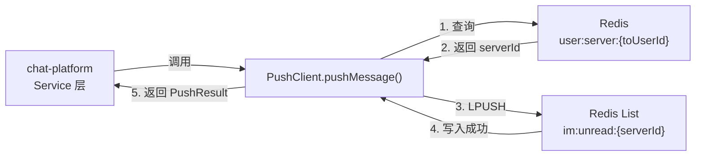

> **图 6：PushClient 工作流程**
>
> chat-client 不直接建立与 chat-server 的网络连接，而是通过 Redis List 作为解耦中间件。这种设计的优势：
> - chat-platform 完全无需知道 chat-server 的网络地址。
> - chat-server 随时扩缩容，只需在 Redis 中注册自己的 server ID。
> - 消息写入即成功，推送由 chat-server 异步消费保证最终送达。

---

### 6.3 chat-server —— 推送服务模块

**模块定位**：基于 Netty 的 WebSocket 服务器，管理客户端长连接，消费 Redis 消息队列并推送。

**处理流程**：

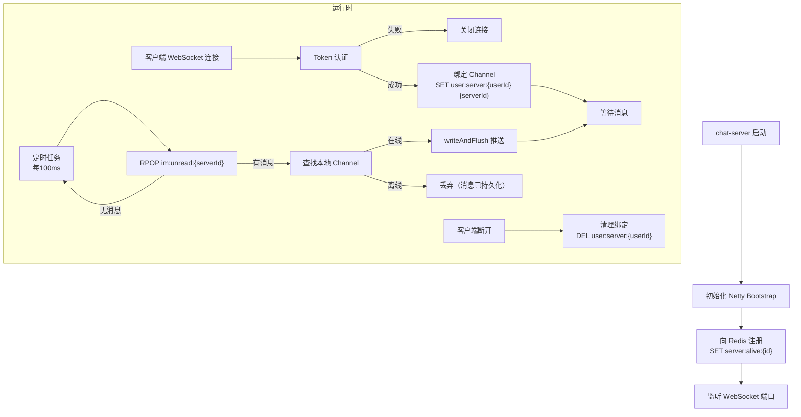

> **图 7：chat-server 消息消费与推送流程**
>
> **关键设计决策**：
> - **定时轮询消费**：与消息监听模式对比，轮询模式实现简单、不依赖 Redis Pub/Sub（Pub/Sub 在集群扩容时存在消息丢失风险）、适合课程设计场景。
> - **离线消息策略**：消息已在 chat-platform 处持久化至 MySQL，chat-server 本地消费失败时消息已在数据库留有副本，接收方上线后通过 HTTP 拉取历史消息，不依赖推送层保证持久性。
> - **Channel 管理**：使用 `ConcurrentHashMap<Long, Channel>` 存储 userId → Channel 映射，用户多窗口登录时以最后连接的 Channel 为准（旧 Channel 被替换关闭）。

**核心 Handler 设计**：

| Handler | 职责 | 处理的信令类型 |
|---|---|---|
| `AuthHandler` | 解析 WebSocket 连接时的 Token，完成身份认证 | 连接握手 |
| `MessageHandler` | 处理客户端发来的消息回执（已读确认等） | ACK、READ_RECEIPT |
| `SignalingHandler` | 转发 WebRTC 信令（offer/answer/ICE candidate） | CALL_OFFER, CALL_ANSWER, ICE_CANDIDATE, CALL_HANGUP |
| `HeartbeatHandler` | 心跳检测，超时断开 | PING/PONG |

---

### 6.4 chat-platform —— 业务平台模块

**模块定位**：系统的业务核心，处理所有 HTTP REST 请求，包含用户管理、消息管理、群组管理、文件上传等完整业务逻辑。

**分层结构**：

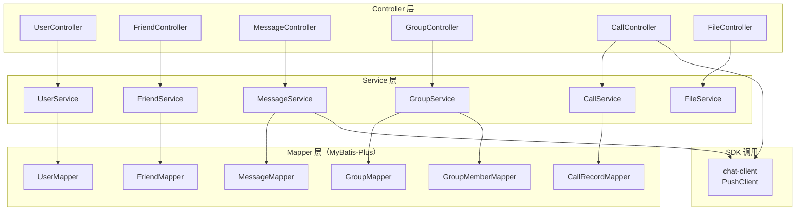

> **图 8：chat-platform 分层结构**
>
> Controller → Service → Mapper 三层标准分层。Service 层包含事务管理与业务编排；跨模块调用（如 MessageService 需要查询 GroupMember）通过依赖注入同一模块内的其他 Service 完成，不跨模块。

**各 Controller 职责**：

| Controller | 路由前缀 | 核心接口 |
|---|---|---|
| `UserController` | `/api/user` | register, login, info, updateInfo, search, online |
| `FriendController` | `/api/friend` | add, delete, list, search |
| `MessageController` | `/api/message` | send, history, offlineMessages, markRead |
| `GroupController` | `/api/group` | create, dismiss, invite, kick, members, list |
| `CallController` | `/api/call` | history, detail |
| `FileController` | `/api/file` | upload, download |

**安全层设计**：

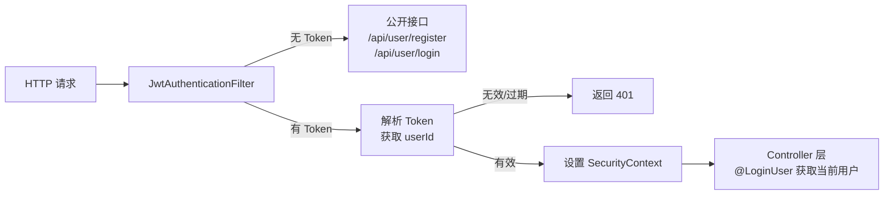

> **图 9：JWT 认证流程**
>
> - 公开接口（注册/登录）不走 JWT 校验。
> - JWT Token 有效期设为 7 天，支持"记住我"场景。
> - `@LoginUser` 自定义注解从 SecurityContext 注入当前登录用户信息，Controller 方法中无需手动解析。

---

### 6.5 chat-web —— 前端模块

**模块定位**：Vue 2 单页应用，提供完整的聊天界面。

**目录结构**：

```
chat-web/
├── public/
│   ├── index.html          # HTML 模板
│   └── logo.svg            # 品牌 Logo（SVG）
├── src/
│   ├── api/                # API 请求封装
│   │   ├── user.js
│   │   ├── friend.js
│   │   ├── message.js
│   │   └── group.js
│   ├── assets/
│   │   ├── iconfont/       # 图标字体
│   │   └── style/
│   │       ├── thems.scss  # 主题色彩变量
│   │       └── im.scss     # 全局样式
│   ├── components/         # 公共组件
│   │   ├── ChatBubble      # 消息气泡
│   │   ├── ContactList     # 联系人列表
│   │   ├── MessageInput    # 消息输入框
│   │   └── CallDialog      # 通话弹窗
│   ├── store/              # Pinia 状态管理
│   │   ├── user.js         # 用户状态
│   │   ├── chat.js         # 聊天状态
│   │   └── call.js         # 通话状态
│   ├── utils/
│   │   ├── websocket.js    # WebSocket 连接管理
│   │   ├── webrtc.js       # WebRTC 通话封装
│   │   └── request.js      # Axios 封装 + 拦截器
│   ├── views/              # 页面视图
│   │   ├── Login.vue       # 登录页
│   │   ├── Register.vue    # 注册页
│   │   └── Home.vue        # 主界面（聊天面板）
│   ├── router/
│   │   └── index.js        # Vue Router
│   ├── App.vue
│   └── main.js
└── package.json
```

**前端核心模块交互**：

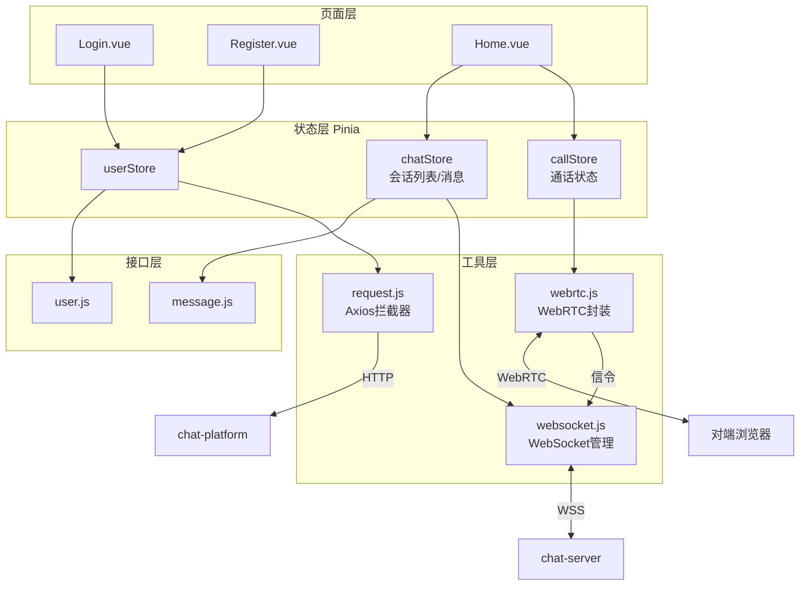

> **图 10：前端模块交互图**
>
> - **双通道设计**：HTTP（Axios → chat-platform）负责业务请求；WebSocket（websocket.js → chat-server）负责实时推送与信令。
> - **Pinia Store** 作为前端单一状态源，视图层不直接操作 WebSocket 或 API，通过 Store 的 actions 驱动。
> - **WebRTC 封装**：`webrtc.js` 封装 RTCPeerConnection 的创建、SDP 交换、ICE 处理、本地媒体流获取，信令通过 `websocket.js` 发送给 chat-server 转发。

---

## 七、核心流程设计

### 7.1 用户注册/登录 —— 时序图

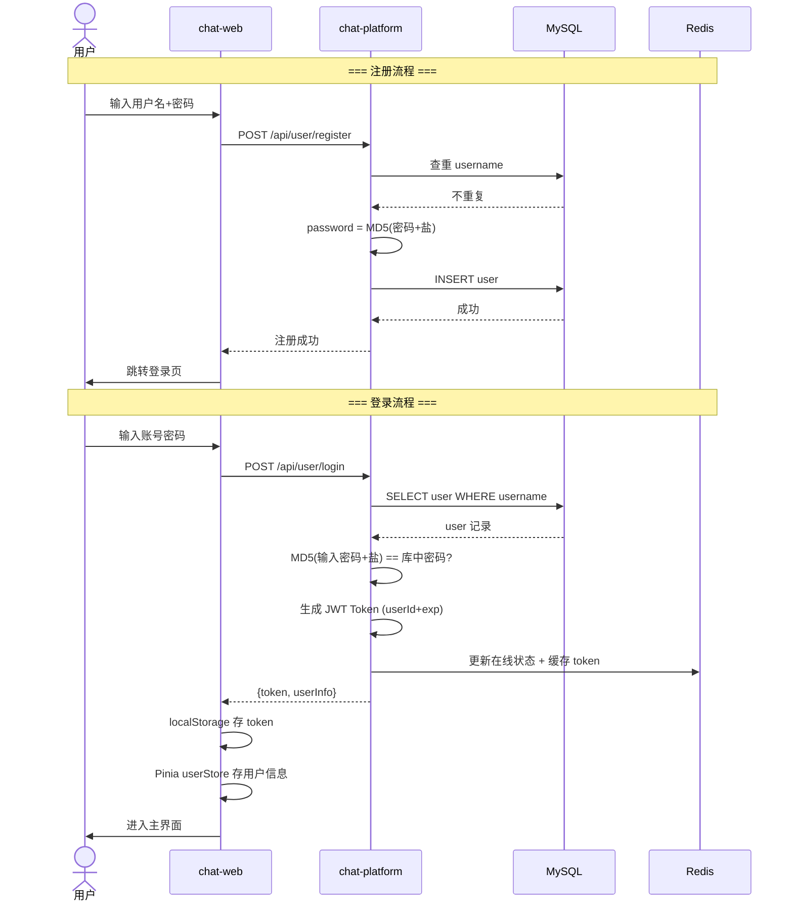

> **图 11：用户注册/登录时序图**
>
> **密码安全**：采用 MD5 加盐哈希，盐值由系统随机生成并存储在配置中（通过环境变量 `${USER_PASSWORD_SALT}` 注入）。不使用明文密码、不使用无盐的简单哈希。

### 7.2 消息发送与跨节点推送 —— 时序图

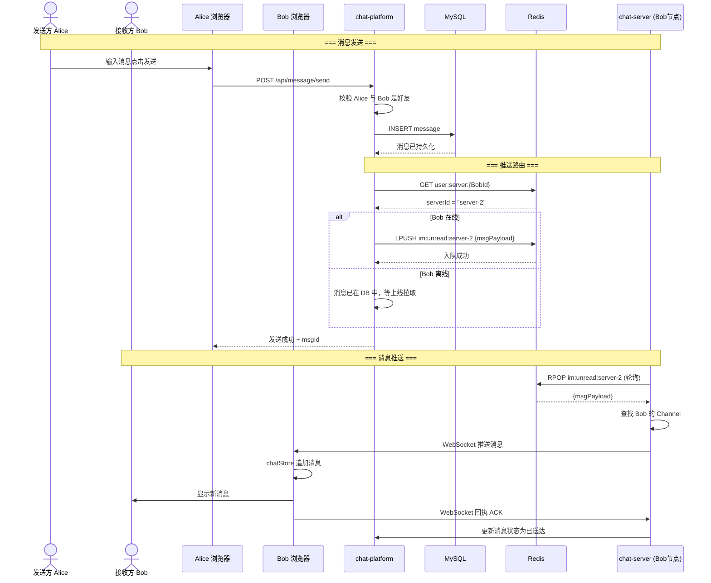

> **图 12：消息发送与跨节点推送时序图**
>
> **核心设计理念**：
> - **先持久化，再推送**：消息先存 MySQL 再入 Redis 队列，保证不丢失。
> - **推拉结合**：在线时主动推送（push），离线时消息已在 DB，上线后 HTTP 拉取（pull）。
> - **ACK 机制**：客户端收到消息后发回 ACK，chat-server 通知 chat-platform 更新消息状态为"已送达"，进一步可更新为"已读"。

### 7.3 消息发送活动图（含附件上传分支）

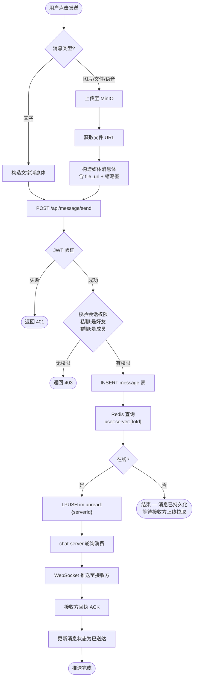

> **图 13：消息发送活动图**
>
> 展示了文字消息和媒体消息两条处理路径在"构造消息体"处汇合，以及权限校验失败时的两条异常路径。

### 7.4 WebRTC 音视频通话 —— 时序图

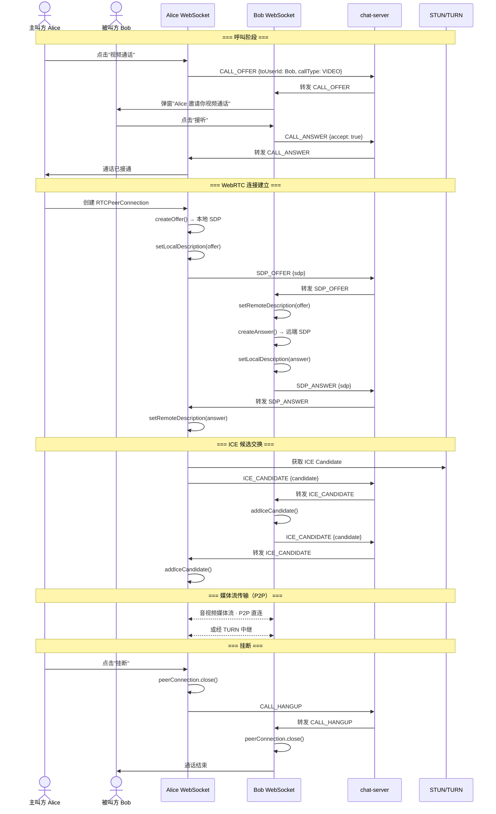

> **图 14：WebRTC 音视频通话时序图**
>
> **信令转发**：chat-server 仅作为信令中继，不参与媒体流传输。SDP、ICE Candidate 等信令通过 `SignalingHandler` 直接转发。
> **媒体传输**：Alice 与 Bob 浏览器之间建立 P2P 直连（理想情况）或经 TURN 服务器中继（NAT 穿透失败时）。
> **通话记录**：挂断后 chat-platform 的 CallController 记录通话开始/结束时间及状态到 `call_record` 表。

### 7.5 离线消息处理 —— 流程图

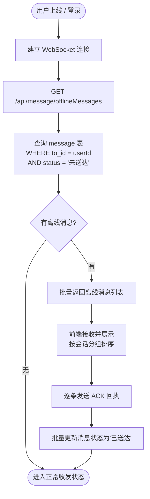

> **图 15：离线消息处理流程**
>
> **设计要点**：
> - 离线消息通过 HTTP 拉取（而非 WebSocket 推送历史），避免 WebSocket 连接建立瞬间大量消息涌入导致 UI 卡顿。
> - 拉取完成后逐条 ACK，批量更新数据库状态，减少 UPDATE 次数。
> - 拉取期间新消息仍可通过 WebSocket 正常推送（两通道并行）。

---

## 八、数据库设计

### 8.1 数据库 ER 图（物理模型）

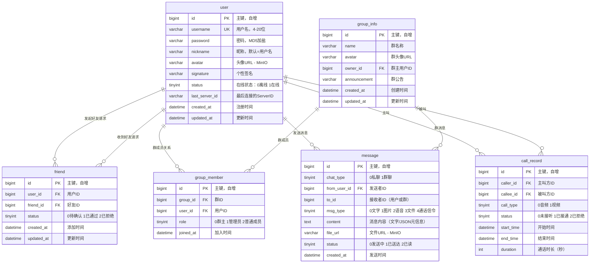

> **图 16：数据库 E-R 图（物理模型）**
>
> 共 6 张核心表。`message.chat_type` 区分私聊/群聊，`message.to_id` 根据类型指向 `user.id` 或 `group_info.id`。
> `user.last_server_id` 为跨节点推送的核心字段，记录用户当前连接的 chat-server 节点 ID。

### 8.2 建表 DDL（节选核心表）

```sql
-- ============================================
-- 用户表
-- ============================================
CREATE TABLE `user` (
    `id`            BIGINT       NOT NULL AUTO_INCREMENT COMMENT '用户ID',
    `username`      VARCHAR(20)  NOT NULL COMMENT '用户名',
    `password`      VARCHAR(64)  NOT NULL COMMENT '密码(MD5加盐)',
    `nickname`      VARCHAR(50)  DEFAULT NULL COMMENT '昵称',
    `avatar`        VARCHAR(255) DEFAULT NULL COMMENT '头像URL(MinIO)',
    `signature`     VARCHAR(200) DEFAULT NULL COMMENT '个性签名',
    `status`        TINYINT      DEFAULT 0 COMMENT '在线状态:0离线 1在线',
    `last_server_id` VARCHAR(64) DEFAULT NULL COMMENT '最后连接的ServerID',
    `created_at`    DATETIME     NOT NULL DEFAULT CURRENT_TIMESTAMP COMMENT '注册时间',
    `updated_at`    DATETIME     NOT NULL DEFAULT CURRENT_TIMESTAMP ON UPDATE CURRENT_TIMESTAMP COMMENT '更新时间',
    PRIMARY KEY (`id`),
    UNIQUE KEY `uk_username` (`username`)
) ENGINE=InnoDB DEFAULT CHARSET=utf8mb4 COMMENT='用户表';

-- ============================================
-- 消息表
-- ============================================
CREATE TABLE `message` (
    `id`            BIGINT       NOT NULL AUTO_INCREMENT COMMENT '消息ID',
    `chat_type`     TINYINT      NOT NULL COMMENT '会话类型:0私聊 1群聊',
    `from_user_id`  BIGINT       NOT NULL COMMENT '发送者ID',
    `to_id`         BIGINT       NOT NULL COMMENT '接收者ID(用户ID或群ID)',
    `msg_type`      TINYINT      NOT NULL COMMENT '消息类型:0文字 1图片 2语音 3文件 4信令',
    `content`       TEXT         DEFAULT NULL COMMENT '消息内容',
    `file_url`      VARCHAR(500) DEFAULT NULL COMMENT '文件URL(MinIO)',
    `status`        TINYINT      DEFAULT 0 COMMENT '状态:0发送中 1已送达 2已读',
    `created_at`    DATETIME     NOT NULL DEFAULT CURRENT_TIMESTAMP COMMENT '发送时间',
    PRIMARY KEY (`id`),
    KEY `idx_chat` (`chat_type`, `to_id`, `created_at`),
    KEY `idx_from_user` (`from_user_id`, `created_at`)
) ENGINE=InnoDB DEFAULT CHARSET=utf8mb4 COMMENT='消息表';

-- ============================================
-- 群组信息表
-- ============================================
CREATE TABLE `group_info` (
    `id`            BIGINT       NOT NULL AUTO_INCREMENT COMMENT '群ID',
    `name`          VARCHAR(50)  NOT NULL COMMENT '群名称',
    `avatar`        VARCHAR(255) DEFAULT NULL COMMENT '群头像URL',
    `owner_id`      BIGINT       NOT NULL COMMENT '群主用户ID',
    `announcement`  VARCHAR(500) DEFAULT NULL COMMENT '群公告',
    `created_at`    DATETIME     NOT NULL DEFAULT CURRENT_TIMESTAMP COMMENT '创建时间',
    `updated_at`    DATETIME     NOT NULL DEFAULT CURRENT_TIMESTAMP ON UPDATE CURRENT_TIMESTAMP COMMENT '更新时间',
    PRIMARY KEY (`id`),
    KEY `idx_owner` (`owner_id`)
) ENGINE=InnoDB DEFAULT CHARSET=utf8mb4 COMMENT='群组信息表';

-- ============================================
-- 群成员表
-- ============================================
CREATE TABLE `group_member` (
    `id`            BIGINT   NOT NULL AUTO_INCREMENT COMMENT '主键',
    `group_id`      BIGINT   NOT NULL COMMENT '群ID',
    `user_id`       BIGINT   NOT NULL COMMENT '用户ID',
    `role`          TINYINT  DEFAULT 2 COMMENT '角色:0群主 1管理员 2普通成员',
    `joined_at`     DATETIME NOT NULL DEFAULT CURRENT_TIMESTAMP COMMENT '加入时间',
    PRIMARY KEY (`id`),
    UNIQUE KEY `uk_group_user` (`group_id`, `user_id`),
    KEY `idx_user` (`user_id`)
) ENGINE=InnoDB DEFAULT CHARSET=utf8mb4 COMMENT='群成员表';

-- ============================================
-- 好友关系表
-- ============================================
CREATE TABLE `friend` (
    `id`            BIGINT   NOT NULL AUTO_INCREMENT COMMENT '主键',
    `user_id`       BIGINT   NOT NULL COMMENT '用户ID',
    `friend_id`     BIGINT   NOT NULL COMMENT '好友ID',
    `status`        TINYINT  DEFAULT 0 COMMENT '0待确认 1已通过 2已拒绝',
    `created_at`    DATETIME NOT NULL DEFAULT CURRENT_TIMESTAMP COMMENT '添加时间',
    `updated_at`    DATETIME NOT NULL DEFAULT CURRENT_TIMESTAMP ON UPDATE CURRENT_TIMESTAMP COMMENT '更新时间',
    PRIMARY KEY (`id`),
    UNIQUE KEY `uk_user_friend` (`user_id`, `friend_id`),
    KEY `idx_friend` (`friend_id`)
) ENGINE=InnoDB DEFAULT CHARSET=utf8mb4 COMMENT='好友关系表';

-- ============================================
-- 通话记录表
-- ============================================
CREATE TABLE `call_record` (
    `id`            BIGINT   NOT NULL AUTO_INCREMENT COMMENT '通话记录ID',
    `caller_id`     BIGINT   NOT NULL COMMENT '主叫方ID',
    `callee_id`     BIGINT   NOT NULL COMMENT '被叫方ID',
    `call_type`     TINYINT  NOT NULL COMMENT '通话类型:0音频 1视频',
    `status`        TINYINT  DEFAULT 0 COMMENT '状态:0未接听 1已接通 2已拒绝',
    `start_time`    DATETIME DEFAULT NULL COMMENT '开始时间',
    `end_time`      DATETIME DEFAULT NULL COMMENT '结束时间',
    `duration`      INT      DEFAULT 0 COMMENT '通话时长(秒)',
    PRIMARY KEY (`id`),
    KEY `idx_caller` (`caller_id`, `start_time`),
    KEY `idx_callee` (`callee_id`, `start_time`)
) ENGINE=InnoDB DEFAULT CHARSET=utf8mb4 COMMENT='通话记录表';
```

### 8.3 Redis 数据结构设计

| Key | 类型 | 说明 | 示例 |
|---|---|---|---|
| `user:server:{userId}` | String | 用户连接的 chat-server ID | `user:server:1001` → `"server-2"` |
| `im:unread:{serverId}` | List | 待推送消息队列（FIFO） | `im:unread:server-2` → `[msgJson1, msgJson2, ...]` |
| `server:alive:{serverId}` | String | 服务器心跳存活标记（TTL 30s） | `server:alive:server-2` → `"1"` |
| `user:token:{userId}` | String | 用户 JWT 缓存（TTL 与 token 一致） | `user:token:1001` → `"eyJhbG..."` |
| `user:online:{userId}` | String | 用户在线状态（TTL 5min） | `user:online:1001` → `"1"` |
| `call:session:{callId}` | Hash | 通话会话临时信息 | `{caller, callee, type, status, createTime}` |

---

## 九、接口设计

### 9.1 REST API 设计规范

| 规范项 | 约定 |
|---|---|
| **基础路径** | `/api` |
| **请求格式** | JSON（Content-Type: application/json） |
| **响应格式** | 统一 `{ "code": 200, "message": "success", "data": {...} }` |
| **认证方式** | Header: `Authorization: Bearer {jwtToken}` |
| **分页参数** | `?page=1&size=20`，响应含 `total`, `pages` |
| **版本** | URL 路径不含版本号（课程设计简化），通过文档管理变更 |

### 9.2 统一响应结构

```json
{
    "code": 200,
    "message": "success",
    "data": {},
    "timestamp": 1750000000000
}
```

**错误码定义**：

| code | 说明 |
|---|---|
| 200 | 成功 |
| 400 | 参数错误 |
| 401 | 未认证 / Token 过期 |
| 403 | 无权限 |
| 404 | 资源不存在 |
| 500 | 服务器内部错误 |
| 10001 | 用户名已存在 |
| 10002 | 密码错误 |
| 10003 | 好友关系已存在 |
| 10004 | 群组不存在 |
| 10005 | 非群成员 |

### 9.3 用户模块 API

| 方法 | 路径 | 说明 | 认证 |
|---|---|---|---|
| POST | `/api/user/register` | 用户注册 | 否 |
| POST | `/api/user/login` | 用户登录 | 否 |
| GET | `/api/user/info` | 获取当前用户信息 | 是 |
| PUT | `/api/user/info` | 修改个人信息（昵称/头像/签名） | 是 |
| GET | `/api/user/search?keyword={}` | 搜索用户（按用户名/昵称） | 是 |
| GET | `/api/user/{id}/status` | 查询用户在线状态 | 是 |

**示例 —— POST /api/user/register**：

```
Request:
{
    "username": "zhangsan",
    "password": "123456"
}

Response:
{
    "code": 200,
    "message": "注册成功",
    "data": { "userId": 1001 }
}
```

### 9.4 好友模块 API

| 方法 | 路径 | 说明 | 认证 |
|---|---|---|---|
| POST | `/api/friend/add` | 添加好友（发送申请） | 是 |
| PUT | `/api/friend/{id}/accept` | 通过好友申请 | 是 |
| DELETE | `/api/friend/{id}` | 删除好友 | 是 |
| GET | `/api/friend/list` | 好友列表 | 是 |

### 9.5 消息模块 API

| 方法 | 路径 | 说明 | 认证 |
|---|---|---|---|
| POST | `/api/message/send` | 发送消息 | 是 |
| GET | `/api/message/history?chatType={}&toId={}&page={}&size={}` | 拉取历史消息（分页） | 是 |
| GET | `/api/message/offline` | 拉取离线消息 | 是 |
| PUT | `/api/message/{id}/read` | 标记消息已读 | 是 |

**示例 —— POST /api/message/send**：

```
Request:
{
    "chatType": 0,
    "toId": 1002,
    "msgType": 0,
    "content": "你好，Bob！",
    "fileUrl": null
}

Response:
{
    "code": 200,
    "message": "发送成功",
    "data": {
        "msgId": 20001,
        "createdAt": "2026-06-20T10:30:00"
    }
}
```

### 9.6 群组模块 API

| 方法 | 路径 | 说明 | 认证 |
|---|---|---|---|
| POST | `/api/group/create` | 创建群组 | 是 |
| POST | `/api/group/{id}/invite` | 邀请成员 | 是 |
| DELETE | `/api/group/{id}/kick/{userId}` | 移出成员（群主/管理员） | 是 |
| DELETE | `/api/group/{id}/dismiss` | 解散群组（群主） | 是 |
| GET | `/api/group/{id}/members` | 群成员列表 | 是 |
| GET | `/api/group/list` | 我的群组列表 | 是 |

### 9.7 文件模块 API

| 方法 | 路径 | 说明 | 认证 |
|---|---|---|---|
| POST | `/api/file/upload` | 上传文件（multipart/form-data） | 是 |
| GET | `/api/file/download/{fileKey}` | 下载/预览文件（返回重定向或流） | 是 |

**文件上传限制**：
- 图片：最大 10MB，支持 jpg/png/gif/webp
- 语音：最大 5MB，支持 mp3/wav/ogg
- 文件：最大 50MB

### 9.8 WebSocket 消息协议

**连接地址**：`ws://{host}:{port}/ws?token={jwtToken}`

**消息帧格式**（JSON）：

```json
{
    "type": "MESSAGE_TYPE",
    "seq": 1,
    "timestamp": 1750000000000,
    "data": {}
}
```

**消息类型定义**：

| type | 方向 | 说明 | data 内容 |
|---|---|---|---|
| `NEW_MESSAGE` | Server→Client | 新消息推送 | {msgId, chatType, fromUser, content, ...} |
| `MESSAGE_ACK` | Client→Server | 消息回执 | {msgId} |
| `MESSAGE_READ` | Client→Server | 标记已读 | {chatType, toId, lastReadMsgId} |
| `CALL_OFFER` | Client→Server→Client | 通话邀请 | {callType, callerInfo} |
| `CALL_ANSWER` | Client→Server→Client | 通话应答 | {accept, callType} |
| `SDP_OFFER` | Client→Server→Client | SDP Offer | {sdp} |
| `SDP_ANSWER` | Client→Server→Client | SDP Answer | {sdp} |
| `ICE_CANDIDATE` | Client→Server→Client | ICE Candidate | {candidate} |
| `CALL_HANGUP` | Client→Server→Client | 挂断 | {} |
| `HEARTBEAT` | Client↔Server | 心跳 | {} |
| `USER_ONLINE` | Server→Client | 好友上线通知 | {userId} |
| `USER_OFFLINE` | Server→Client | 好友下线通知 | {userId} |

---

## 十、核心类图设计

### 10.1 chat-platform 核心类图

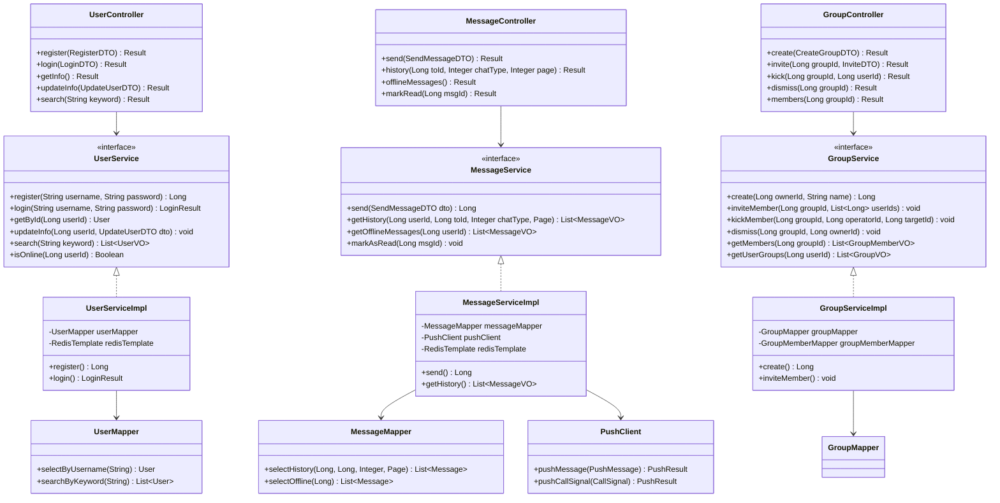

> **图 17：chat-platform 核心类图**
>
> Controller → Service（接口） → ServiceImpl → Mapper 的标准分层。`MessageServiceImpl` 额外依赖 `PushClient`（来自 chat-client 模块）完成消息推送。

### 10.2 chat-server 核心类图

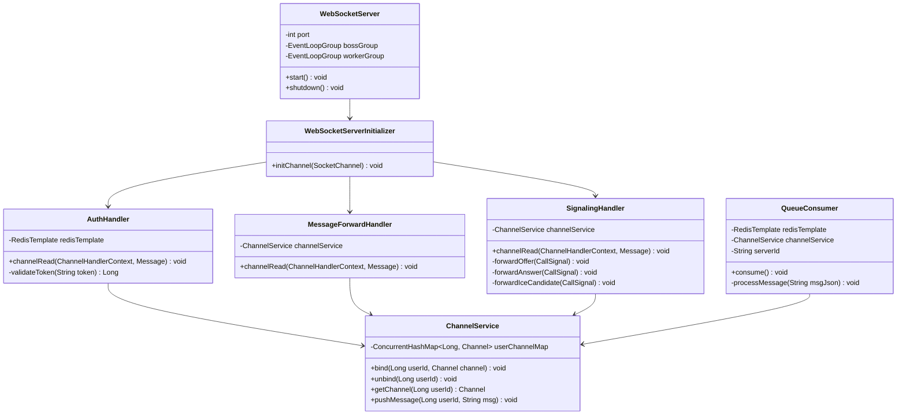

> **图 18：chat-server 核心类图**
>
> - `WebSocketServer` 为 Netty 服务启动入口。
> - `ChannelService` 是连接管理的核心，以 `ConcurrentHashMap` 存储 userId→Channel 映射。
> - `QueueConsumer` 独立线程轮询 Redis 队列，发现消息后通过 `ChannelService.pushMessage()` 推送。

---

## 十一、安全设计

### 11.1 身份认证

| 环节 | 方案 | 说明 |
|---|---|---|
| 登录认证 | JWT（JSON Web Token） | 登录成功后签发，有效期 7 天 |
| Token 传递 | HTTP Header: `Authorization: Bearer {token}` | 前端 Axios 拦截器自动附加 |
| WebSocket 认证 | URL 参数: `ws://host/ws?token={token}` | AuthHandler 在握手阶段校验 |
| Token 续期 | 暂无（课程设计简化） | 过期后重新登录 |
| 密码存储 | MD5 + 随机盐 | 盐值通过 ${USER_PASSWORD_SALT} 环境变量注入 |

### 11.2 权限控制

| 场景 | 控制方式 |
|---|---|
| 好友间发消息 | 校验 friend 表是否存在通过状态的好友关系 |
| 群聊发消息 | 校验 group_member 表是否存在该用户 |
| 群管理操作 | 校验 group_member.role 是否为群主/管理员 |
| 文件访问 | 文件下载前校验消息归属（发送方或接收方） |

### 11.3 敏感信息保护（规约第十条）

| 敏感项 | 保护方式 |
|---|---|
| 数据库密码 | `${DB_PASSWORD}` 环境变量 |
| JWT Secret | `${JWT_SECRET}` 环境变量 |
| MinIO AccessKey/SecretKey | `${MINIO_ACCESS_KEY}` / `${MINIO_SECRET_KEY}` |
| 用户密码盐值 | `${USER_PASSWORD_SALT}` |
| TURN 服务器凭证 | `${TURN_CREDENTIAL}` |

所有敏感配置均不在代码/配置文件中硬编码，通过 `${}` 占位符引用环境变量，本地开发使用 `.gitignore` 忽略的 `application-local.yml`。

### 11.4 通信加密

| 层 | 协议 | 说明 |
|---|---|---|
| HTTP API | HTTPS（生产） | Nginx 做 SSL 终止 |
| WebSocket | WSS（生产） | 经 Nginx 升级 |
| WebRTC 媒体流 | DTLS-SRTP | 浏览器 WebRTC 内置加密 |

---

# 第三部分：AI 辅助

## 十二、AI 辅助系统设计使用说明

### 12.1 概述

本系统设计文档在编制过程中使用了 AI 大语言模型（Claude 4.x）进行辅助设计。AI 工具在以下环节发挥了关键作用：

### 12.2 AI 辅助的具体环节

| 环节 | AI 作用 | 使用方式 |
|---|---|---|
| **需求文档解析** | 自动阅读 `需求分析文档.md` 中的 21 项功能需求、19 项非功能需求、ER 图、数据流图，提取结构化设计输入 | 将需求文档全文输入 AI，由 AI 识别设计约束、实体关系、流程节点，作为系统设计的输入 |
| **架构方案比选** | 对关键架构决策点提供多方案对比分析 | AI 对"Redis Pub/Sub vs Redis List 队列""推模式 vs 推拉结合"等决策点，给出至少两个方案及取舍分析，由人工确认 |
| **分层与模块划分** | 根据规约中的四模块约束，细化各模块的包结构、类职责、依赖关系 | AI 在规约约束范围内（不可更改模块数），设计内部包结构与类层次 |
| **时序图/活动图/流程图生成** | 根据需求中的活动图，细化为技术层面的时序图与流程图 | AI 根据需求活动图推导出登录、消息推送、WebRTC 通话等核心流程的详细时序图 Mermaid 代码 |
| **数据库物理设计** | 将 E-R 概念模型转换为 DDL 语句，设计索引策略 | AI 根据需求中的 E-R 图生成规范化 DDL，并基于查询场景建议索引 |
| **API 接口设计** | 根据功能需求推导 REST API 端点、请求/响应结构 | AI 根据 CRUD 模式与业务需求，设计 RESTful 接口并保持一致性 |
| **类图设计** | 根据模块职责与流程推导核心类的属性与方法 | AI 依据分层架构与职责，生成核心类图的 Mermaid 代码 |
| **WebSocket 协议设计** | 定义消息帧格式与信令类型 | AI 参考 WebRTC 信令标准与 IM 通用协议模式，设计统一的消息协议 |
| **安全设计对照检查** | 对照规约第十条与需求中的非功能安全需求，逐项检查设计是否满足 | AI 将规约安全要求映射到具体设计措施，标记漏项 |
| **Mermaid 图表代码生成** | 生成系统架构图、包图、类图、时序图、流程图等全部图表的 Mermaid 代码 | AI 将所有设计内容转换为可渲染的 Mermaid 图表代码，确保在支持 Mermaid 的编辑器中直接预览 |

### 12.3 架构决策记录（ADR）

以下关键设计决策由 AI 提供多方案对比，经人工确认后采纳：

#### ADR-1：消息队列方案 —— Redis List vs Redis Pub/Sub

| 方案 | 优势 | 劣势 | 采纳 |
|---|---|---|---|
| **Redis List（LPUSH/RPOP）** | 消息持久化在 List 中；消费者崩溃不丢消息；天然支持多消费者（每个消费自己的 queue） | 需轮询（100ms 间隔），有微小延迟 | ✅ 采纳 |
| Redis Pub/Sub | 实时推送，延迟极低 | 消费者离线时消息丢失；集群扩容时无消息重放；channel 命名复杂度高 | ❌ |

**决策理由**：课程设计场景下 100ms 轮询延迟完全可接受，Redis List 的持久性与消费可靠性更符合"消息不丢失"的非功能需求。

#### ADR-2：离线消息获取 —— 推 vs 拉

| 方案 | 优势 | 劣势 | 采纳 |
|---|---|---|---|
| **上线后 HTTP 拉取** | 前端可控拉取时机；不冲击 WebSocket 连接；按会话分页拉取 | 需额外接口 | ✅ 采纳 |
| WebSocket 推历史消息 | 单通道，实现简化 | 上线瞬间大量消息涌入导致 UI 卡顿；需服务端维护离线消息队列 | ❌ |

**决策理由**：推拉结合——在线消息实时 WebSocket 推送，离线消息 HTTP 拉取，各取所长。

#### ADR-3：WebRTC 信令通道 —— 复用 WebSocket vs 独立信令服务

| 方案 | 优势 | 劣势 | 采纳 |
|---|---|---|---|
| **复用现有 WebSocket** | 无需额外服务；减少端口/连接数；信令与消息共通道简化前端 | 信令与消息争用同一通道 | ✅ 采纳 |
| 独立信令服务 | 职责单一、隔离 | 增加运维复杂度；前端需维护双 WebSocket 连接 | ❌ |

**决策理由**：课程设计项目规模下，WebRTC 信令量与消息量均不高，复用同一 WebSocket 足够。

### 12.4 AI 使用经验与建议

1. **规约即边界，AI 驱动设计不可越界**  
   本项目的 `CLAUDE.md` 对架构模块数、技术栈做了硬性约束。AI 在设计时须始终以规约为硬边界，不擅自引入新框架或破坏单向依赖。实践中，AI 在生成包图时最初将 chat-server 设计为依赖 chat-client，经对照规约复查后纠正。**建议**：每次 AI 产出的设计成果须对照规约逐条核对。

2. **顺序化设计流程**  
   本项目采用"需求分析文档 → 系统设计文档"的流程。AI 先产出需求文档（含用例图、活动图、数据流图、ER 图），再基于需求文档产出系统设计文档。这种顺序保证了设计有据可依，每一步的输出都是下一步的输入。**建议**：不跳过需求直接做设计，不跳过设计直接写代码。

3. **图表语言的统一**  
   全部图表使用 Mermaid 语法，可在 GitHub、VS Code、Typora 等工具中直接渲染。AI 生成图表后需人工验证语义正确性（连接线方向、实体属性完整性）。实践中 AI 偶尔在复杂时序图中遗漏返回箭头，需人工补全。

4. **架构决策须有人工确认**  
   规约第六条明确规定"存在多种实现路径时，先调研，给出至少两个可选方案及取舍，由人选择"。本文档的 ADR 章节即为 AI 提供多方案对比、人工确认的实践产物。**建议**：将关键设计决策记录为 ADR，保留决策上下文与理由，便于后续维护。

5. **数据库设计与索引须结合实际查询**  
   AI 可根据 ER 图生成规范化 DDL，但索引策略需结合具体查询场景。本设计中，`message` 表的复合索引 `(chat_type, to_id, created_at)` 即由人工根据"拉取某会话的历史消息"这一最高频查询补充设计。

6. **Mermaid 代码的版本管理**  
   Mermaid 源码与 Markdown 文档一并纳入 Git 版本管理。图表修改时，通过 diff 可清晰看到逻辑变更。AI 在修改图表时应保持 Mermaid 代码风格一致（统一缩进、命名规范）。

---

## 十三、附录

### 附录 A：参考文档

| 文档 | 说明 |
|---|---|
| `CLAUDE.md` | 项目强制规约（架构/技术栈/Git/文档等） |
| `README.md` | 项目概览、技术栈、模块职责 |
| `PLAN.md` | 前端 UI 品牌化改造计划书 |
| `需求分析文档.md` v1.0 | 需求定义、用例图、活动图、数据流图、ER 图 |

### 附录 B：术语表

| 术语 | 说明 |
|---|---|
| ADR | Architecture Decision Record，架构决策记录 |
| SDP | Session Description Protocol，WebRTC 媒体会话描述协议 |
| ICE | Interactive Connectivity Establishment，WebRTC 网络连接建立框架 |
| STUN | Session Traversal Utilities for NAT，NAT 穿透协议 |
| TURN | Traversal Using Relays around NAT，中继穿透协议 |
| P2P | Peer-to-Peer，端到端直连通信 |
| WSS | WebSocket Secure，加密 WebSocket 协议 |
| FIFO | First In First Out，先入先出队列 |

### 附录 C：Mermaid 图表索引

| 图号 | 图名 | 类型 |
|---|---|---|
| 图 1 | 系统架构图 | Graph |
| 图 2 | 分层架构图 | Graph |
| 图 3 | 后端包图 | Graph |
| 图 4 | 部署拓扑图 | Graph |
| 图 5 | 跨节点消息路由机制 | Flowchart |
| 图 6 | PushClient 工作流程 | Flowchart |
| 图 7 | chat-server 消息消费与推送流程 | Flowchart |
| 图 8 | chat-platform 分层结构 | Graph |
| 图 9 | JWT 认证流程 | Flowchart |
| 图 10 | 前端模块交互图 | Graph |
| 图 11 | 用户注册/登录时序图 | Sequence |
| 图 12 | 消息发送与跨节点推送时序图 | Sequence |
| 图 13 | 消息发送活动图 | Flowchart |
| 图 14 | WebRTC 音视频通话时序图 | Sequence |
| 图 15 | 离线消息处理流程 | Flowchart |
| 图 16 | 数据库 E-R 图（物理模型） | ER Diagram |
| 图 17 | chat-platform 核心类图 | Class |
| 图 18 | chat-server 核心类图 | Class |

> **提示**：所有 Mermaid 图表可在 VS Code（安装 Mermaid 插件）、Typora、GitHub 等支持 Mermaid 渲染的 Markdown 编辑器中直接预览。

---

> **文档结束**
>
> 本文档基于 `CLAUDE.md` 项目规约、`需求分析文档.md` v1.0 编写，遵循"总体设计→详细设计"的结构，涵盖了系统架构、模块设计、数据库设计、接口设计、核心流程设计等内容，并通过 18 张 Mermaid 图表辅助描述。AI 在架构方案比选、图表生成、协议设计、安全检查等环节提供了辅助，关键决策均有人工确认。
