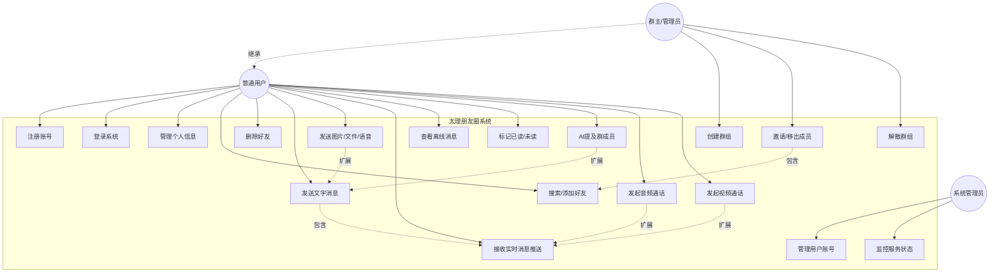
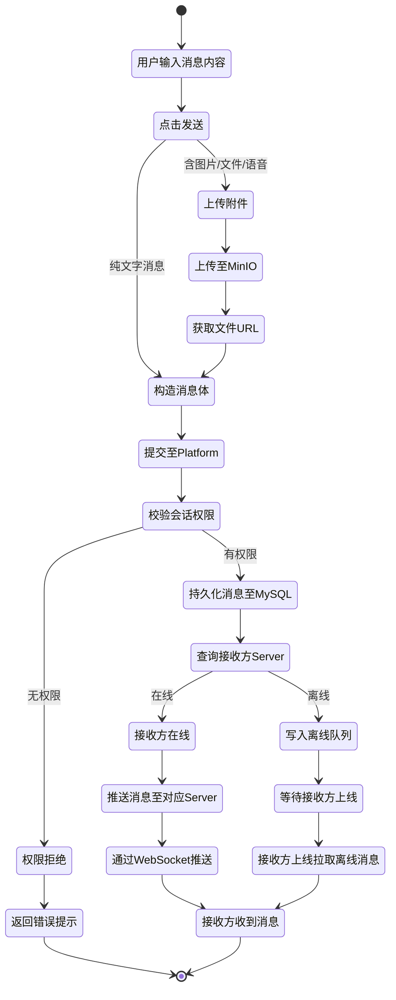
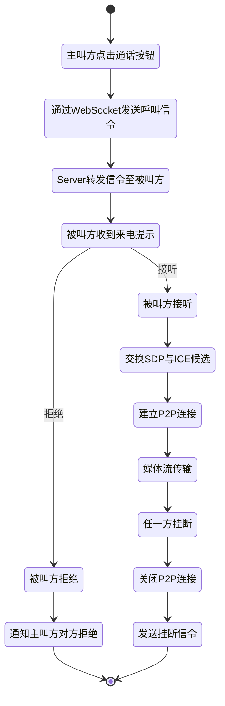
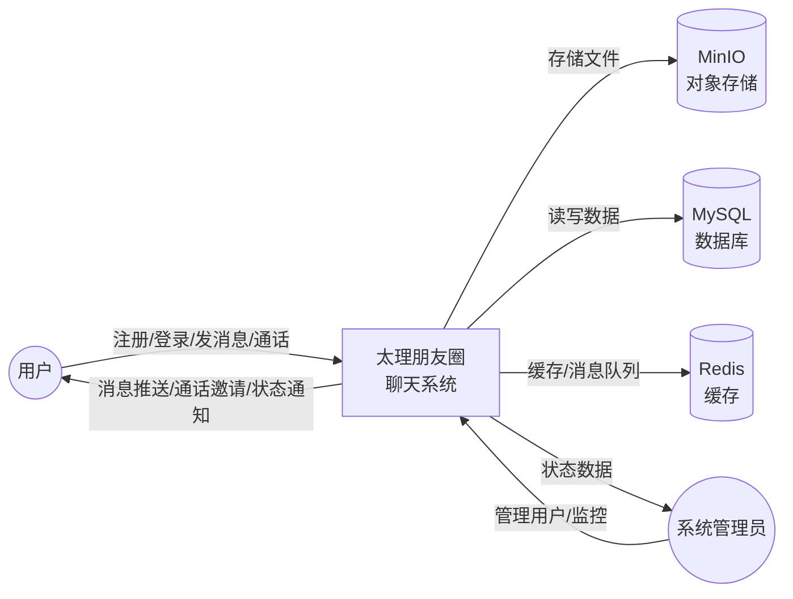
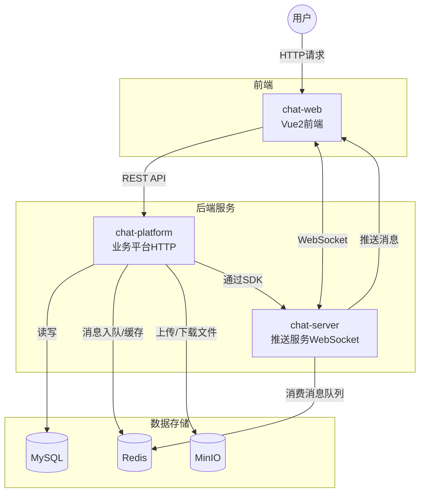
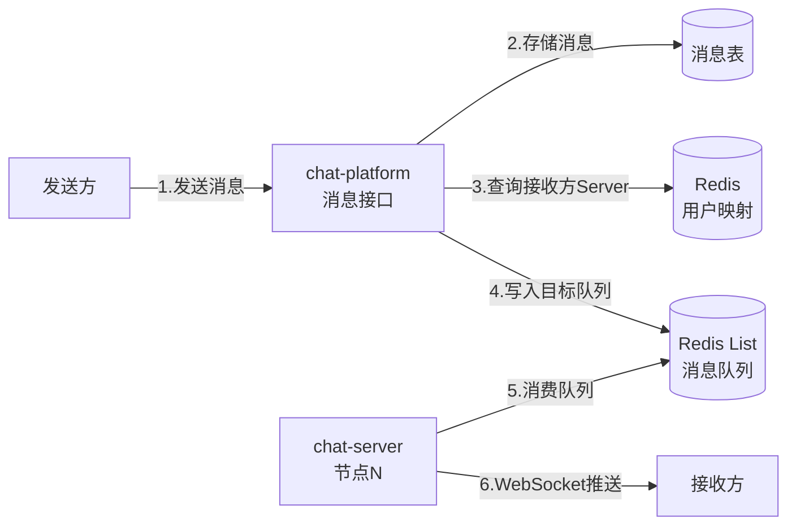
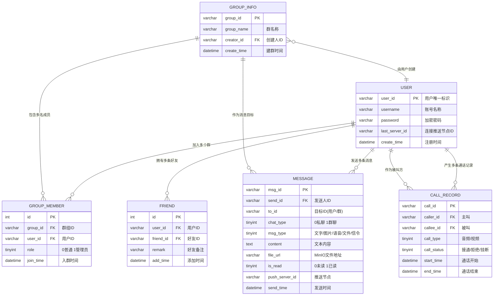

# 太理朋友圈 —— 需求分析文档

> 版本：v1.0  
> 日期：2026-06-18  
> 作者：软件2457 第六小组

---

## 目录

1. [问题定义](#一问题定义)
2. [可行性研究](#二可行性研究)
3. [需求分析](#三需求分析)
   - 3.1 [用户角色](#31-用户角色)
   - 3.2 [功能需求](#32-功能需求)
   - 3.3 [用例图](#33-用例图)
   - 3.4 [活动图](#34-活动图)
   - 3.5 [数据流图](#35-数据流图)
   - 3.6 [E-R 图](#36-e-r-图)
   - 3.7 [非功能需求](#37-非功能需求)
4. [AI 辅助需求分析使用说明](#四ai-辅助需求分析使用说明)
5. [附录](#五附录)

---

## 一、问题定义

### 1.1 背景

太原理工大学校内有大量师生存在即时通讯的需求——课程协作、社团活动、实验室沟通、校园通知等。目前存在这以下问题：

| 痛点 | 说明 |
|---|---|
| **工具碎片化** | 师生分散在微信、QQ、钉钉等多个平台，缺乏校内统一的沟通工具 |
| **隐私与数据安全** | 校园内部交流依赖商业第三方平台，聊天数据留存在校外服务器，存在隐私风险 |
| **教学场景适配不足** | 通用 IM 工具缺乏面向校园场景的定制能力（如课程群、实验室群管理） |
| **成本问题** | 商业音视频通话 SDK 按量/按并发收费，对课程设计/校内部署不友好 |
| **扩展性受限** | 小型 IM 系统常为单节点部署，无法支撑校内数千用户的并发需求 |

### 1.2 系统目标

构建一个**仿微信的网页聊天系统"太理朋友圈"**，面向太原理工大学师生，提供私聊、群聊、文件分享、音视频通话等核心即时通讯功能。系统须满足以下目标：

1. **统一沟通平台**：校内师生在同一平台上完成即时通讯，消除碎片化。
2. **数据自主可控**：服务端部署在校内/自有服务器，聊天数据不外泄。
3. **全功能覆盖**：覆盖文字消息、语音、图片、文件、音视频通话等主流 IM 能力。
4. **可集群部署**：支持横向扩展，满足千人级并发。
5. **低成本运行**：音视频通话基于原生 WebRTC，不依赖收费第三方 SDK。
6. **品牌化与设计感**：消除"模板化"观感，具备校园品牌辨识度。

### 1.3 系统范围

本系统覆盖以下范围：
- **包含**：Web 端即时通讯（私聊/群聊）、消息推送、文件/图片/语音收发、音视频通话、离线消息、已读回执、@提及、用户注册登录、好友/群组管理。
- **不包含**：移动端 App（Native）、朋友圈/动态流、支付/红包、小程序、第三方登录、AI 聊天机器人、端到端加密。

---

## 二、可行性研究

### 2.1 技术可行性

| 维度 | 分析 | 结论 |
|---|---|---|
| **后端框架** | Spring Boot 3.3 + Netty：成熟的企业级框架，Netty 提供高性能 WebSocket 长连接支持，社区活跃 | 可行 |
| **消息推送集群化** | 基于 Redis List 实现跨节点消息路由（`im:unread:${serverId}` 队列），已设计完整方案 | 可行 |
| **实时音视频** | WebRTC 原生 API，浏览器原生支持，无需付费第三方 SDK；仅需信令服务器（已通过 WebSocket 承载） | 可行 |
| **数据存储** | MySQL 8.0（关系型）+ Redis（缓存/消息队列）+ MinIO（对象存储，存放图片/文件/语音）；均为开源成熟方案 | 可行 |
| **前端技术** | Vue 2 + Element UI + Pinia：成熟的 Web 前端栈，Element UI 提供丰富组件加速开发 | 可行 |
| **部署环境** | JDK 17 + Node.js 18 + Maven 3.9，均为 LTS 版本，稳定性有保障 | 可行 |
| **团队技能** | 课程设计项目，团队成员具备 Java/Vue 基础，技术栈与课程教学高度匹配 | 可行 |

**综合结论：技术方案可行。** 所选技术栈均为成熟、开源、社区活跃的方案，且有完整的设计文档支撑。

### 2.2 经济可行性

| 维度 | 分析 |
|---|---|
| **开发成本** | 课程设计项目，人力成本为零（教学计划内） |
| **软件许可** | 全部采用开源技术栈（Spring Boot、MySQL、Redis、MinIO、Vue 等），无许可费用 |
| **音视频通话** | 基于 WebRTC 原生能力，无需购买第三方音视频 SDK（如腾讯云 TRTC、声网 Agora 等），仅需 TURN/STUN 服务器（可自建或使用免费服务） |
| **硬件/云资源** | 校内服务器或低配云主机即可起步，Redis + MinIO 均为轻量级中间件 |
| **运维成本** | Docker 容器化部署，运维成本低 |

**综合结论：经济可行。** 全链路零许可费用，适合课程设计及校内轻量部署。

### 2.3 操作可行性

- **用户群体**：大学生及教师，对微信式聊天界面高度熟悉，学习成本极低。
- **使用方式**：Web 端浏览器访问，无需安装客户端，即开即用。
- **管理维护**：系统管理人员通过后台接口/脚本运维，操作简单。

### 2.4 法律与合规可行性

- 系统部署在校内服务器，数据归学校/项目组所有，不涉及第三方数据合规问题。
- 用户注册需遵守《网络安全法》相关要求（实名制或学号绑定）。
- WebRTC 端到端加密传输，满足基本通信安全要求。

**综合结论：项目可行，建议启动开发。**

---

## 三、需求分析

### 3.1 用户角色

| 角色 | 说明 |
|---|---|
| **普通用户** | 太原理工大学师生，系统的核心使用者。可以注册/登录、添加好友、发起私聊/群聊、收发各类消息、发起音视频通话。 |
| **群主/管理员** | 拥有群组管理权限的普通用户。可创建群、解散群、踢人、设置群公告。 |
| **系统管理员** | 负责系统运维的后台角色。管理用户账号、监控服务状态、处理举报。 |

### 3.2 功能需求

#### 3.2.1 用户模块

| 编号 | 功能 | 描述 | 优先级 |
|---|---|---|---|
| F-01 | 用户注册 | 用户通过用户名/密码注册账号 | P0 |
| F-02 | 用户登录 | 用户凭账号密码登录，获取 JWT 令牌 | P0 |
| F-03 | 个人信息管理 | 修改头像、昵称、个性签名 | P1 |
| F-04 | 好友管理 | 搜索用户、添加/删除好友、好友列表 | P0 |
| F-05 | 在线状态 | 显示用户在线/离线状态 | P1 |

#### 3.2.2 消息模块

| 编号 | 功能 | 描述 | 优先级 |
|---|---|---|---|
| F-06 | 私聊 | 一对一文字消息收发，实时推送 | P0 |
| F-07 | 群聊 | 多人群组文字消息收发 | P0 |
| F-08 | 离线消息 | 接收方不在线时缓存消息，上线后推送 | P0 |
| F-09 | 语音消息 | 录制并发送语音片段 | P1 |
| F-10 | 图片消息 | 发送图片（上传至 MinIO） | P1 |
| F-11 | 文件消息 | 发送文件（上传至 MinIO） | P2 |
| F-12 | 已读/未读 | 消息已读状态标记与回执 | P1 |
| F-13 | 群 At 提及 | 在群聊中 @ 特定成员 | P1 |

#### 3.2.3 音视频通话模块

| 编号 | 功能 | 描述 | 优先级 |
|---|---|---|---|
| F-14 | 一对一音频通话 | 基于 WebRTC 的实时音频通话 | P1 |
| F-15 | 一对一视频通话 | 基于 WebRTC 的实时视频通话 | P1 |

#### 3.2.4 群组管理模块

| 编号 | 功能 | 描述 | 优先级 |
|---|---|---|---|
| F-16 | 创建群组 | 用户创建群聊，自动成为群主 | P0 |
| F-17 | 邀请/移出成员 | 群主/管理员邀请新成员或移出成员 | P1 |
| F-18 | 解散群组 | 群主解散群组 | P1 |

#### 3.2.5 系统特性模块

| 编号 | 功能 | 描述 | 优先级 |
|---|---|---|---|
| F-19 | 多窗口同步 | 同一用户多窗口/多标签页同时在线，消息实时同步 | P2 |
| F-20 | 集群化部署 | chat-server 支持多节点部署，消息跨节点路由 | P1 |
| F-21 | 前端品牌化 | 自定义 Logo、主题色彩、图标体系，消除模板化观感 | P1 |

### 3.3 用例图

> **图 1：系统用例图**  
> 普通用户为核心角色，群主/管理员继承普通用户权限并扩展群组管理能力。系统管理员独立于业务用例，负责后台运维。消息推送（M3）作为基用例被多数消息类用例包含。

### 3.4 活动图

#### 3.4.1 用户发送消息活动图

> **图 2：用户发送消息活动图**  
> 展示了消息从发送到接收的完整流程，包括附件上传、权限校验、持久化、在线推送与离线缓存两条路径。

#### 3.4.2 音视频通话建立活动图

> **图 3：音视频通话活动图**  
> 展示了 WebRTC 通话的信令交换流程。信令通过 WebSocket 转发，媒体流经 STUN/TURN 建立 P2P 直连传输。

### 3.5 数据流图

#### 3.5.1 顶层数据流图（上下文图）

> **图 4：顶层数据流图**  
> 外部实体为用户和系统管理员；系统与 MySQL、Redis、MinIO 三个数据存储交互。

#### 3.5.2 第 0 层数据流图（系统级）

> **图 5：第 0 层数据流图**  
> 前端通过 HTTP 请求访问 chat-platform 处理业务；通过 WebSocket 直连 chat-server 接收实时推送。chat-platform 通过 chat-client SDK 将待推送消息写入 Redis 队列，chat-server 消费队列后推送给目标用户。

#### 3.5.3 消息发送数据流图（第 1 层，关键流程）

> **图 6：消息发送数据流图（第 1 层）**  
> 展示了跨节点消息路由的完整数据流：platform 写入目标 server 的专属队列，对应 server 消费后推送。

### 3.6 E-R 图

> **图 7：系统 E-R 图**  
> 核心实体包括用户（USER）、好友关系（FRIEND）、群组（GROUP_INFO/GROUP_MEMBER）、消息（MESSAGE）、通话记录（CALL_RECORD）。  
>
> - `chat_type` 区分私聊与群聊，`to_id` 根据类型指向用户或群组。  
> - `msg_type` 区分文字/图片/语音/文件/通话信令，文件类消息通过 `file_url` 指向 MinIO。  
> - `last_server_id` 记录用户最后连接的 chat-server 节点，用于跨节点消息路由。

### 3.7 非功能需求

| 类别 | 需求项 | 指标/说明 |
|---|---|---|
| **性能** | 消息推送延迟 | 同节点推送小于 200ms，跨节点推送小于 500ms |
| **性能** | 并发在线用户 | 支持 1000 以上用户同时在线（集群模式） |
| **性能** | 接口响应时间 | HTTP API P95 小于 500ms |
| **可用性** | 系统可用性 | 核心服务（chat-platform、chat-server）可用性 99.5% 以上 |
| **可用性** | 离线消息可靠性 | 离线消息不丢失，上线后完整推送 |
| **可扩展性** | 水平扩展 | chat-server 支持无状态多节点部署，通过 Redis 队列解耦 |
| **安全性** | 身份认证 | JWT 令牌认证，令牌过期机制 |
| **安全性** | 密码存储 | 密码加盐哈希存储，禁止明文 |
| **安全性** | 敏感信息保护 | 数据库密码、JWT secret、MinIO 密钥等通过环境变量注入，不硬编码（规约第十条） |
| **安全性** | 通信加密 | WebRTC DTLS-SRTP 加密；生产环境建议 HTTPS 加 WSS |
| **可维护性** | 模块化架构 | 后端四模块单向依赖，职责清晰（规约第二条） |
| **可维护性** | 数据库变更版本化 | 所有 DDL/DML 脚本放入 `db/更新脚本/`，命名带版本号（规约第十一条） |
| **可维护性** | 文档管理 | 详细文档统一存放 `docs/`，按类别分子目录（规约第九条） |
| **可维护性** | Git 提交规范 | 一个 commit 只做一件事，中文祈使句 message（规约第四条） |
| **兼容性** | 浏览器兼容 | 支持 Chrome、Edge、Firefox 最新两个大版本（WebRTC 兼容） |
| **兼容性** | 多窗口同步 | 同一用户在多个标签页同时登录，消息实时同步 |
| **用户体验** | UI 设计感 | 消除 Element UI 模板化观感，具备品牌辨识度（PLAN.md 目标） |
| **用户体验** | 界面语言 | 中文界面，符合校园使用场景 |

---

## 四、AI 辅助需求分析使用说明

### 4.1 概述

本需求分析文档在编制过程中使用了 AI 大语言模型（Claude）进行辅助分析。AI 工具在以下环节发挥了关键作用：

### 4.2 AI 辅助的具体环节

| 环节 | AI 作用 | 使用方式 |
|---|---|---|
| **文档信息提取** | 自动阅读 `README.md`、`CLAUDE.md`、`PLAN.md` 三份规约文档，提取关键信息并结构化 | 将 md 文档输入 AI，由 AI 解析项目背景、技术栈、架构、功能列表 |
| **需求梳理与归类** | 根据 README 的功能特性列表，结合 IM 系统领域知识，将需求拆解为用户/消息/通话/群组/系统五大模块 | AI 根据通用 IM 系统知识进行模块划分，人工审核确认 |
| **用例识别** | 从三份文档中识别出普通用户、群主/管理员、系统管理员三类角色及其用例 | AI 分析文档中的功能描述，推导角色与用例的对应关系 |
| **图表生成** | 自动生成用例图、活动图、数据流图、E-R 图的 Mermaid 代码 | AI 根据需求分析结果，按 UML 建模规范生成 Mermaid 图表代码 |
| **非功能需求推导** | 根据规约文档中的技术选型、架构约束、性能要求，推导非功能需求指标 | AI 结合规约文档（如集群化方案推导可扩展性、JWT 推导安全性） |
| **可行性分析** | 从技术、经济、操作、法律四个维度评估项目可行性 | AI 根据技术栈成熟度、开源许可、部署规模等进行分析 |

### 4.3 使用建议与注意事项

1. **AI 作为辅助，人工主导决策**  
   AI 提供需求初稿、图表代码、模块划分建议，但最终需求范围的界定、优先级的排序、非功能指标的量化需由项目组人工确认。规约第六条明确规定："存在多种实现路径时，先调研，给出至少两个可选方案及取舍，由人选择"。

2. **图表渲染**  
   本文档中的 Mermaid 图表代码可在支持 Mermaid 的 Markdown 编辑器（VS Code + Mermaid 插件、Typora、GitHub 等）中直接渲染。

3. **需求迭代**  
   AI 辅助分析适用于**快速产出需求初稿**。随着项目推进，需求文档应以实际开发反馈和用户测试结果为准进行迭代修订，不可将 AI 初稿作为不变基准。

4. **领域知识补充**  
   AI 可补充通用 IM 系统（消息推送、WebRTC 信令、离线消息队列）的领域知识，但对太原理工大学的具体校情、师生规模、使用习惯等本地化信息，需项目组补充调研。

5. **与项目规约的关系**  
   本需求分析文档须服从 `CLAUDE.md` 中的项目规约。需求变更时，须同步评估对规约中架构、技术栈、模块边界的影响。大规模需求变更须先写计划书并经审查（规约第七条）。

---

## 五、附录

### 附录 A：参考文档

| 文档 | 路径 | 说明 |
|---|---|---|
| 项目 README | `README.md` | 项目概览、技术栈、启动说明 |
| 项目规约 | `CLAUDE.md` | 强制执行的架构、编码、Git、文档规约 |
| 前端改造计划书 | `PLAN.md` | 前端 UI 品牌化改造的任务拆解与风险分析 |

### 附录 B：术语表

| 术语 | 说明 |
|---|---|
| IM | Instant Messaging，即时通讯 |
| WebRTC | Web Real-Time Communication，浏览器实时通信协议 |
| WebSocket | 全双工通信协议，用于消息实时推送 |
| JWT | JSON Web Token，用于用户身份认证 |
| MinIO | 开源对象存储服务，兼容 Amazon S3 |
| Netty | Java 高性能 NIO 网络框架 |
| MyBatis-Plus | MyBatis 增强工具，简化数据库操作 |
| Druid | 阿里巴巴开源数据库连接池 |
| Redisson | Redis Java 客户端，提供分布式锁等高级功能 |
| STUN/TURN | NAT 穿透服务器/中继服务器，WebRTC 基础设施 |
| SDP | Session Description Protocol，描述 WebRTC 媒体会话 |
| ICE | Interactive Connectivity Establishment，WebRTC 网络连接建立协议 |

